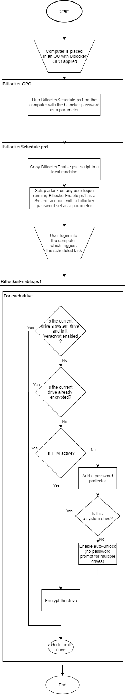
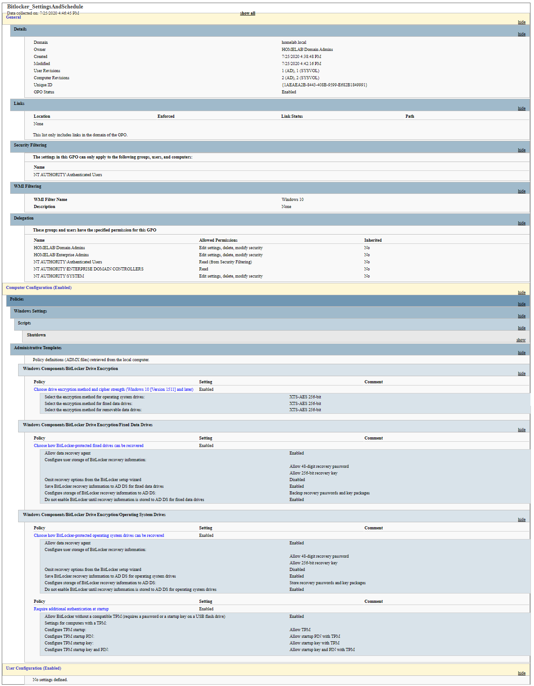

# Bitlocker Enforce

**Ensure encryption on Windows 10 machines**

I've experimented with multiple approaches and this one seem to work the best for my use.

## Table of contents

- [Goal](#goal)
- [Short description](#Short-description)
- [Detailed description](#Detailed-description)
    - [Flowchart](#Flowchart)
    - [WMI filtering](#WMI-filtering)
    - [GPO settings](#GPO-settings)
    - [BitlockerSchedule.ps1](#BitlockerSchedule.ps1)
    - [BitlockerEnable.ps1](#BitlockerEnable.ps1)
- [Future considerations](#Future-considerations)

## Goal
I use this configuration to ensure all Windows 10 machines within a specific OU are enrypted, while:
* number of internal drives vary; all internal drives should be encrypted
* recovery password for all machines is backed up to AD 
* machines with no TPM require a pre-boot password
* if a system drive is already encrypted with Veracrypt - skip it

## Short description
When a computer is placed in a specific OU, a GPO is being applied with a shutdown script enabled.
This script then copies another script and schedules a task to run copied script as a System account during any user logon.
When any user logs into the machine the encryption is started (with some extra steps ensuring all the requirements from the [Goal](#goal) section are applied)

## Detailed description
### Flowchart
<details>
<summary>Click to see the flowchart</summary>

</details>

### WMI filtering

To apply GPO only to Windows 10 machines (and skip Windows Servers):
```
select * from Win32_OperatingSystem where Version like "10.%" and ProductType="1"
```
Source: [docs.microsoft.com](https://docs.microsoft.com/en-us/windows/security/threat-protection/windows-firewall/create-wmi-filters-for-the-gpo)

### GPO settings

* **Policies > Windows Settings > Scripts > Shutdown**
    * is set to run BitlockerSchedule.ps1 with a parameter set to a password for TPMless machines
* **Policies > Administrative Templates > Windows Components > Bitlocker Drive Encyption > Choose drive encryption method and cipher strength (Windows 10 [Version 1511] and later)** 
    * is enabled
    * encryption method matches the one specified in BitlockerEnable.ps1
* **Policies > Administrative Templates > Windows Components > Bitlocker Drive Encyption > Fixed Data Drives > Choose how BitLocker-protected fixed drives can be recovered**
    * is enabled
    * "Save BitLocker recovery information to AD DS for fixed data drives" is enabled
    * "Do not enable BitLocker until recovery information is stored to AD DS for fixed data drives" is enabled
* **Policies > Administrative Templates > Windows Components > Bitlocker Drive Encyption > Operating System Drives > Choose how BitLocker-protected operating system drives can be recovered** 
    * is enabled
    * "Save BitLocker recovery information to AD DS for fixed data drives" is enabled
    * "Do not enable BitLocker until recovery information is stored to AD DS for fixed data drives" is enabled
* **Policies > Administrative Templates > Windows Components > Bitlocker Drive Encyption > Operating System Drives > Require additional authentication at startup**
    * is enabled
    * "Allow BitLocker without a compatible TPM (requires a password or a startup key on a USB flash drive)" is enabled
    * "Configure TPM startup" is set to "Allow TPM"

<details>
<summary>Click to see the full report of this GPO</summary>

</details>

### BitlockerSchedule.ps1
* Copies BitlockerEnable.ps1 from the SYSVOL share on the domain controller to the local machine
* Schedules a task to run BitlockerEnable.ps1 as the local System account with a trigger at any user logon and passes the parameter (password for TPMless machines) to the script

Have a look at [BitlockerSchedule.ps1](.\BitlockerSchedule.ps1) for the exact solution

### BitlockerEnable.ps1
* Changes the action preference to stop the script in case of any errors
* Reads the password from the parameter
* Sets the enryption method and local logs paths
* Reads TPM and Veracrypt status
* Loops over each drive to enable enryption based on all parameters
* Restores default error action

Have a look at [BitlockerEnable.ps1](.\BitlockerEnable.ps1) for the exact solution

## Future considerations
* Running a local script as a local System account could be a serious security voulnarebility, but from my testing User group was unable to alter the script placed in C:\Windows\temp (default ACL is set to allow Users to create/append files, but it's only applied to the (sub)folder, so they only can write to files owned/created by themselves).
* Having the unlock password specified in the scheduled task is an accepted risk, logged in user should already know this password and the only case the attacker could read this password, would be before the encryption was applied, so the system was already compromised.
* [BitlockerEnable.ps1](.\BitlockerEnable.ps1) is not really checking if the system drive is encrypted with Veracrypt, only if it's installed. For my usecase that's good enough, but I could check with [Verastatus](https://github.com/veracrypt/VeraStatus) if it's actually encrypted.